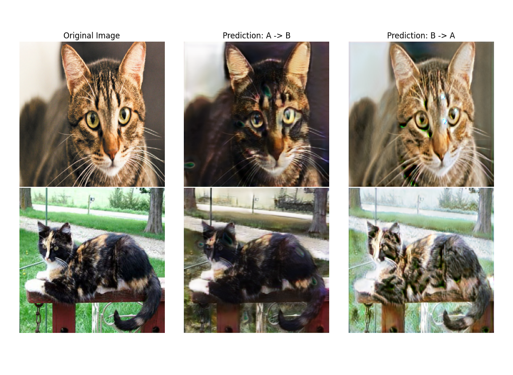

# CycleGAN-cat
- Style transfer from brown tabby cats to tortoiseshell.
- Support for UNet/ResNet generators and UNet/Simple CNN discriminators

TODO
1. Improve style transfer in general
2. Support for arbitrary image sizes when predicting
3. Optimizations to data pipeline

